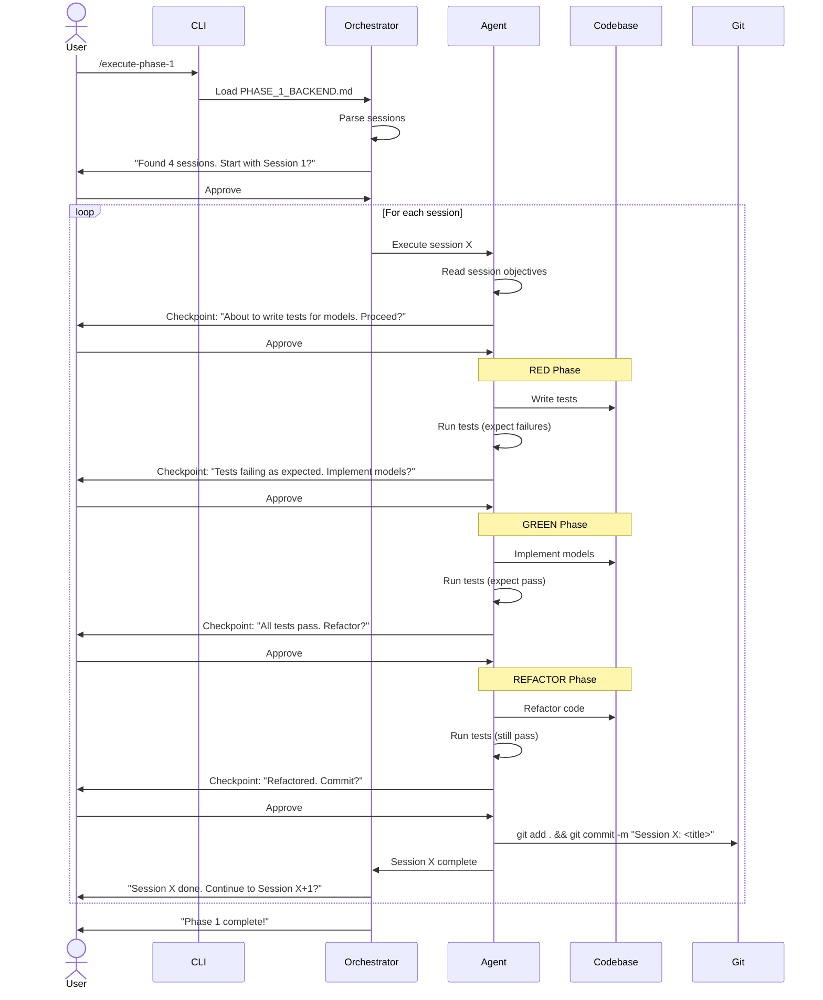

# Agent Integration Architecture (Phase 3)

**Status**: Design Phase
**Goal**: Enable automated execution of generated project plans with human-in-the-loop checkpoints

---

## Overview

The Agent Integration system transforms the planning tool from a **plan generator** into a **plan executor**. After `/plan-app` generates a comprehensive plan, specialized executor agents can implement the plan session-by-session, following TDD workflows and seeking human approval at checkpoints.

## Philosophy

**"Good plans enable agent execution"** - Our plans are structured, detailed, and TDD-driven by design, making them executable by agents with minimal ambiguity.

### Key Principles

1. **Session-by-Session Execution**: Agents execute one session at a time, never rushing ahead
2. **TDD Enforcement**: Agents MUST follow RED-GREEN-REFACTOR for every session
3. **Human-in-the-Loop**: Agents pause for approval before commits and after session completion
4. **Error Recovery**: Agents can handle test failures, rollback changes, and ask for help
5. **State Persistence**: Track which sessions are done, current session, and blockers
6. **Plan Fidelity**: Agents follow the plan exactly as written, no improvisation

---

## Architecture Components

### 1. Executor Agents

Specialized agents that read plans and execute sessions:

| Agent | Purpose | Reads | Outputs |
|-------|---------|-------|---------|
| **backend-builder** | Implements backend sessions (models, serializers, viewsets) | `PHASE_1_BACKEND_FOUNDATION.md` | Django code, tests, migrations |
| **frontend-builder** | Implements frontend sessions (components, composables, views) | `PHASE_2_FRONTEND_FOUNDATION.md` | Vue components, composables, Zod schemas |
| **mobile-builder** | Implements mobile sessions (screens, navigation) | `PHASE_3_MOBILE_APP.md` | React Native screens, navigation |
| **integration-tester** | Implements E2E testing sessions | `PHASE_4_INTEGRATION.md` | Playwright tests, E2E workflows |

**Location**: `.claude/agents/backend-builder.md`, `.claude/agents/frontend-builder.md`, etc.

### 2. Session State Tracker

Tracks execution progress:

```json
{
  "project_name": "my-blog",
  "current_phase": 1,
  "current_session": 2,
  "completed_sessions": ["phase_1_session_1"],
  "in_progress": "phase_1_session_2",
  "blocked_sessions": [],
  "last_checkpoint": "2025-11-16T10:30:00Z",
  "status": "in_progress"
}
```

**Location**: `project-plans/<app-name>/.agent-state.json`

### 3. Checkpoint System

Agents pause at checkpoints for human approval:

**Checkpoint Types**:
1. **Before Session Start**: Show what will be built, ask permission to proceed
2. **After Tests Written (RED)**: Show failing tests, ask permission to implement
3. **After Implementation (GREEN)**: Show passing tests, ask permission to refactor
4. **After Refactor**: Show final code, ask permission to commit
5. **After Session Complete**: Show summary, ask permission to move to next session

**User Responses**:
- ✅ **Approve**: Continue to next step
- 🔄 **Request Changes**: Agent makes adjustments, shows again
- ⏸️ **Pause**: Stop execution, save state, resume later
- ❌ **Abort Session**: Rollback changes, return to last checkpoint

### 4. Plan Parser

Agents need to extract structured tasks from markdown plans:

```typescript
interface Session {
  number: number
  title: string
  objectives: string[]
  tdd_workflow: {
    red_phase: Task[]
    green_phase: Task[]
    refactor_phase: Task[]
  }
  files_to_create: string[]
  dependencies: number[]  // Session numbers that must complete first
  exit_criteria: string[]
  estimated_time: string
  estimated_tests: number
}
```

**Parsing Logic**:
- Read `PHASE_X_<name>.md`
- Extract sessions (sections starting with `## Session X:`)
- Parse TDD workflow (subsections `### Step 1: Write Tests FIRST (RED)`, etc.)
- Extract file lists (code blocks with file paths)
- Parse exit criteria (checklist items)

### 5. Invocation Commands

Users invoke agents via slash commands or function calls:

```bash
# Start from beginning
/execute-phase-1

# Resume from checkpoint
/resume-session 3

# Execute specific session
/execute-session phase=1 session=2

# Execute all sessions (with checkpoints)
/execute-plan
```

---

## Execution Workflow

### High-Level Flow



### Detailed Session Execution

**Session 1: Models + Admin (Backend)**

1. **Parse Session Plan**:
   ```markdown
   ## Session 1: Models + Admin (TDD)
   ### Objectives
   - [ ] Create Django app: `python manage.py startapp blog`
   - [ ] Define Post, Comment, Category, Tag models
   - [ ] Register models in Django admin
   - [ ] Write comprehensive model tests
   ```

2. **Checkpoint 1: Before Start**:
   ```
   📋 Session 1: Models + Admin

   I will:
   - Create Django app 'blog'
   - Define 4 models (Post, Comment, Category, Tag)
   - Write ~70 model tests
   - Register models in admin

   Estimated time: 2.5 hours

   Proceed? [Approve / Modify / Cancel]
   ```

3. **RED Phase: Write Tests**:
   - Create `backend/apps/blog/tests/test_models.py`
   - Write tests for Post model (creation, validation, relationships)
   - Write tests for Comment model (nested replies)
   - Write tests for Category and Tag models
   - Run tests: `docker compose run --rm django pytest apps/blog/tests/test_models.py`
   - **Expected**: All tests FAIL (models don't exist)

4. **Checkpoint 2: After RED**:
   ```
   ✅ Wrote 72 model tests
   ❌ All tests failing (expected)

   Test summary:
   - test_post_creation - FAILED (Post model doesn't exist)
   - test_post_slug_generation - FAILED
   - test_comment_nesting - FAILED
   - ...

   Implement models? [Approve / Show Tests / Cancel]
   ```

5. **GREEN Phase: Implement**:
   - Create `backend/apps/blog/models.py`
   - Implement Post model with all fields
   - Implement Comment model with self-referential FK
   - Implement Category and Tag models
   - Add `__str__` methods, Meta classes, indexes
   - Run migrations: `makemigrations` → `migrate`
   - Run tests: **Expected**: All tests PASS

6. **Checkpoint 3: After GREEN**:
   ```
   ✅ All 72 tests passing!

   Coverage: 92%

   Models created:
   - Post (13 fields, 4 relationships)
   - Comment (8 fields, nested structure)
   - Category (4 fields)
   - Tag (3 fields)

   Refactor? [Approve / Skip Refactor / Cancel]
   ```

7. **REFACTOR Phase**:
   - Add docstrings to models
   - Optimize query hints (select_related, prefetch_related)
   - Extract common fields to abstract base class if applicable
   - Run tests: **Expected**: Still all PASS

8. **Checkpoint 4: After REFACTOR**:
   ```
   ✅ Refactoring complete
   ✅ All 72 tests still passing
   ✅ Coverage: 93%

   Changes:
   - Added docstrings to all models
   - Extracted TimestampedModel abstract base
   - Added select_related hints to Post.author

   Commit? [Approve / Show Diff / Cancel]
   ```

9. **Commit**:
   ```bash
   git add backend/apps/blog/
   git commit -m "feat(blog): Add Post, Comment, Category, Tag models

   - Implement 4 models with full field definitions
   - Add nested comment support (parent FK)
   - Auto-generate slugs for Post, Category, Tag
   - Register models in Django admin
   - Add 72 comprehensive model tests (93% coverage)

   Session 1 complete.

   🤖 Generated with Claude Code
   Co-Authored-By: Claude <noreply@anthropic.com>"
   ```

10. **Session Complete**:
    ```
    ✅ Session 1: Models + Admin - COMPLETE

    Summary:
    - Created 4 models
    - Wrote 72 tests (93% coverage)
    - All tests passing
    - Committed to git

    Next: Session 2: Serializers + ViewSets

    Continue to Session 2? [Yes / Pause / Review]
    ```

---

## State Management

### Session States

```typescript
enum SessionStatus {
  NOT_STARTED = "not_started",
  IN_PROGRESS = "in_progress",
  RED_PHASE = "red_phase",          // Tests written, failing
  GREEN_PHASE = "green_phase",      // Implementation done, tests passing
  REFACTOR_PHASE = "refactor_phase", // Refactoring in progress
  AWAITING_APPROVAL = "awaiting_approval", // At checkpoint
  COMPLETED = "completed",
  BLOCKED = "blocked",              // Can't proceed (dependency not met, error)
  SKIPPED = "skipped"               // User chose to skip
}
```

### State Persistence

After each checkpoint, save state to `project-plans/<app-name>/.agent-state.json`:

```json
{
  "project_name": "my-blog",
  "plan_version": "1.0",
  "execution_started_at": "2025-11-16T09:00:00Z",
  "last_updated_at": "2025-11-16T10:45:00Z",

  "phases": [
    {
      "number": 1,
      "name": "Backend Foundation",
      "status": "in_progress",
      "sessions": [
        {
          "number": 1,
          "title": "Models + Admin",
          "status": "completed",
          "started_at": "2025-11-16T09:00:00Z",
          "completed_at": "2025-11-16T10:30:00Z",
          "commit_hash": "a1b2c3d",
          "tests_written": 72,
          "tests_passing": 72,
          "coverage": 93
        },
        {
          "number": 2,
          "title": "Serializers + ViewSets",
          "status": "red_phase",
          "started_at": "2025-11-16T10:35:00Z",
          "checkpoint": "awaiting_approval_after_red",
          "tests_written": 90,
          "tests_passing": 0
        }
      ]
    }
  ],

  "blockers": [],
  "notes": "Session 1 completed successfully. Session 2 in RED phase, awaiting approval to implement."
}
```

**Benefits**:
1. **Resume from interruption**: User can pause and resume later
2. **Track progress**: See exactly what's done and what's left
3. **Audit trail**: Know when each session completed, commit hashes
4. **Error recovery**: If agent crashes, know where to restart

---

## Error Handling

### Test Failures

**Scenario**: Tests fail unexpectedly in GREEN phase

**Agent Response**:
```
❌ Tests failing after implementation (unexpected)

Failed tests:
- test_post_slug_generation - AssertionError: Expected 'hello-world', got 'hello world'
- test_comment_nesting - AttributeError: 'Comment' object has no attribute 'replies'

This indicates implementation issues. I can:
1. Debug and fix (automatic)
2. Show you the code for review
3. Rollback and retry

What should I do? [Debug / Show Code / Rollback]
```

**Debug Flow**:
1. Agent reads test error messages
2. Agent checks implementation for issues
3. Agent fixes code
4. Agent re-runs tests
5. If still failing after 2 attempts → ask for human help

### Dependency Errors

**Scenario**: Session 5 (API Client) fails because OpenAPI schema generation broken

**Agent Response**:
```
🚫 Blocked: Cannot generate API client

Error: OpenAPI schema generation failed
Cause: Missing drf-spectacular in INSTALLED_APPS

This is a blocker for Session 5 and all frontend work.

I can:
1. Add drf-spectacular to INSTALLED_APPS (automatic fix)
2. Pause and let you fix manually
3. Skip this session (not recommended)

What should I do? [Auto-fix / Manual / Skip]
```

### Merge Conflicts

**Scenario**: User made manual changes while agent was paused, causing conflicts

**Agent Response**:
```
⚠️ Merge conflict detected

Files with conflicts:
- backend/apps/blog/models.py (manual edits detected)

I cannot proceed automatically. Please:
1. Resolve conflicts manually
2. Run tests to ensure nothing broke
3. Run `/resume-session 3` when ready

I'll wait for you.
```

---

## Human-in-the-Loop Checkpoints

### Checkpoint Design

**Principles**:
1. **Always show what will happen** before doing it
2. **Always show what happened** after doing it
3. **Never surprise the user** with unexpected changes
4. **Provide clear options** (Approve, Modify, Cancel)
5. **Show diffs** when modifying code

### Checkpoint Examples

**Before Implementation**:
```
📋 About to implement PostSerializer

Files to create:
- backend/apps/blog/serializers/post.py (new file)

The serializer will:
- Serialize all Post fields (title, content, status, etc.)
- Include nested author (read-only)
- Include category and tag relationships
- Validate title length (5-200 chars)
- Validate published_at required if status='published'

Proceed? [Yes / Show Example / Cancel]
```

**After Implementation**:
```
✅ PostSerializer implemented

Files created:
- backend/apps/blog/serializers/post.py (127 lines)

Key features:
- All fields serialized correctly
- Nested author with UserSerializer
- Categories and tags as PrimaryKeyRelatedField
- Custom validate() method for published_at

Tests: 28/28 passing
Coverage: 91%

Review? [Show Code / Approve / Request Changes]
```

---

## Agent Coordination

### Multi-Agent Scenarios

**Scenario**: User wants to work on backend AND frontend in parallel

**Approach 1: Sequential (Safe)**:
```bash
# Complete all backend sessions first
/execute-phase-1  # Sessions 1-4 (backend)

# Then frontend
/execute-phase-2  # Sessions 5-8 (frontend)
```

**Approach 2: Parallel (Advanced)**:
```bash
# Terminal 1: Backend agent
/execute-session phase=1 session=1
# ... complete Session 1
/execute-session phase=1 session=2
# ... complete Session 2

# Terminal 2: Frontend agent (can start after Session 2 generates API)
/execute-session phase=2 session=5  # API client generation
# ... requires Session 2 complete

# Terminal 3: Another developer can work on Session 4 (Permissions)
# if it doesn't depend on Session 3
```

**Coordination via State File**:
- Agents read `.agent-state.json` before starting
- Check if dependencies met (Session 5 needs Session 2 complete)
- Lock file mechanism to prevent conflicts

---

## Next Steps

### Implementation Phases

**Phase 3.1: Core Infrastructure** (Week 1)
- [ ] Create `.agent-state.json` schema
- [ ] Create plan parser (markdown → structured data)
- [ ] Create checkpoint system (prompts, user input handling)
- [ ] Create state persistence (save/load state)

**Phase 3.2: Backend Builder Agent** (Week 2)
- [ ] Create `backend-builder.md` agent prompt
- [ ] Implement session execution logic
- [ ] Implement TDD workflow (RED-GREEN-REFACTOR)
- [ ] Test with blog template Session 1

**Phase 3.3: Frontend Builder Agent** (Week 3)
- [ ] Create `frontend-builder.md` agent prompt
- [ ] Implement component generation logic
- [ ] Implement Zod schema generation
- [ ] Test with blog template Session 5-8

**Phase 3.4: Integration & Polish** (Week 4)
- [ ] Create orchestrator (manages multiple agents)
- [ ] Create `/execute-phase` commands
- [ ] Create `/resume-session` recovery
- [ ] End-to-end testing (full plan execution)

**Phase 3.5: Mobile & E2E Agents** (Week 5)
- [ ] Create `mobile-builder.md` agent
- [ ] Create `integration-tester.md` agent
- [ ] Test with complex template (e-commerce)

---

## Open Questions

1. **Checkpoint Frequency**: Too many checkpoints = annoying, too few = risky. What's the right balance?
   - **Proposal**: 4 checkpoints per session (before start, after RED, after GREEN, after REFACTOR)

2. **Error Tolerance**: How many auto-retry attempts before asking for human help?
   - **Proposal**: 2 auto-retries for test failures, 0 for compilation errors (ask immediately)

3. **State Storage**: JSON file vs database vs in-memory?
   - **Proposal**: JSON file (simple, version-controllable, no DB dependency)

4. **Parallel Execution**: Allow multiple agents or enforce sequential?
   - **Proposal**: Start with sequential (simpler), add parallel in Phase 3.5

5. **Rollback Strategy**: If session fails, rollback just that session or entire phase?
   - **Proposal**: Rollback just the session (use git reset --hard to last checkpoint commit)

6. **User Override**: Can user manually edit code between sessions?
   - **Proposal**: Yes, but agent warns if conflicts detected, asks user to resolve

---

## Success Metrics

**Phase 3 is successful when**:

- [ ] Agent can execute a complete backend phase (4 sessions) without errors
- [ ] Agent follows TDD strictly (RED-GREEN-REFACTOR)
- [ ] All checkpoints work correctly (user can approve/cancel)
- [ ] State persists and resumes correctly after interruption
- [ ] Test coverage meets targets (>85%)
- [ ] Generated code matches plan specifications
- [ ] Commits are clean with good messages
- [ ] User can review and approve each step
- [ ] Error recovery works (test failures, dependency issues)

**Ultimate Goal**: User runs `/plan-app` → approves plan → runs `/execute-plan` → reviews at checkpoints → gets a working app in hours instead of days.

---

**Next**: Create individual agent specifications (backend-builder, frontend-builder, etc.)
