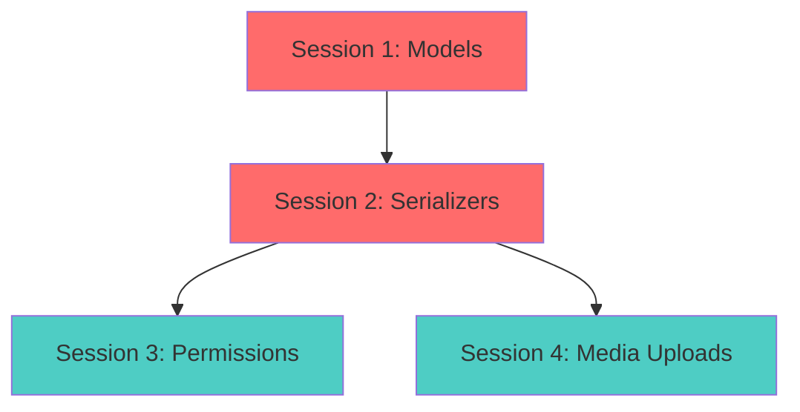

# /execute-phase - Execute an entire phase with parallel session execution

Execute all sessions in a phase with dependency-aware parallelization and human-in-the-loop checkpoints.

## Usage

```
/execute-phase <project-name> <phase-number> [options]
```

**Examples**:
```
/execute-phase my-blog 1
/execute-phase acme-store 2
/execute-phase my-saas 1 --sequential  # Disable parallelization
/execute-phase my-blog 3 --max-concurrent 2  # Limit to 2 parallel sessions
```

**Options**:
- `--sequential`: Disable parallelization (run sessions one at a time)
- `--max-concurrent N`: Limit max concurrent sessions (default: 3)
- `--stop-on-error`: Stop entire phase if any session fails (default: continue)

---

## What This Command Does

1. **Loads state**: Reads `.agent-state.json` for the project
2. **Validates phase**: Ensures phase exists and previous phases are complete
3. **Analyzes dependencies**: Builds dependency graph from Mermaid diagrams
4. **Shows parallelization plan**: Displays which sessions will run in parallel
5. **Executes phase with parallelization**:
   - CHECKPOINT 1: Before phase starts
   - Execute sessions in dependency order (parallelized when possible)
   - Each session follows RED-GREEN-REFACTOR with its own checkpoints
   - CHECKPOINT 2: After phase completes
6. **Updates state**: Saves progress to `.agent-state.json`

---

## Execution Instructions

When user runs this command, you should:

### Step 1: Load and Validate

```typescript
// Load state
const state = loadState(project_name)
if (!state) {
  error("No state found for project. Run /initialize-project first.")
}

// Find phase
const phase = state.phases.find(p => p.number === phase_number)
if (!phase) {
  error(`Phase ${phase_number} not found`)
}

// Check if previous phases are complete
const previousPhases = state.phases.filter(p => p.number < phase_number)
const incompletePreviousPhases = previousPhases.filter(p => p.status !== 'completed')

if (incompletePreviousPhases.length > 0) {
  warn(`Previous phases not complete: ${incompletePreviousPhases.map(p => p.number).join(', ')}`)
  ask("Continue anyway? (y/N)")
}

// Check if already completed
if (phase.status === 'completed') {
  warn(`Phase ${phase_number} already completed.`)
  ask("Re-run anyway? (y/N)")
}
```

### Step 2: Analyze Parallelization Opportunities

```typescript
import { PhaseOrchestrator } from '.claude/infrastructure/phase-orchestrator'

const orchestrator = new PhaseOrchestrator()
const analysis = orchestrator.analyzeParallelization(phase)

/**
 * Example analysis output:
 * {
 *   sequential_sessions: [2, 3],  // Sessions with dependencies
 *   parallel_groups: [
 *     { sessions: [Session 1], can_run: true },      // Group 1: No dependencies
 *     { sessions: [Session 2, Session 3], can_run: false },  // Group 2: After Session 1
 *     { sessions: [Session 4], can_run: false }      // Group 3: After Sessions 2+3
 *   ],
 *   max_parallelism: 2,  // Max 2 sessions can run together
 *   estimated_time_sequential: 10.5,  // Hours if run sequentially
 *   estimated_time_parallel: 7.2      // Hours if parallelized
 * }
 */
```

### Step 3: Show Parallelization Plan

**Show to user**:
```
┌─────────────────────────────────────────────────────────────┐
│ PHASE ${phase_number}: ${phase.name}
│
│ Total Sessions: ${phase.sessions.length}
│ Estimated Time (sequential): ${analysis.estimated_time_sequential}h
│ Estimated Time (parallel): ${analysis.estimated_time_parallel}h
│ Time Savings: ${Math.round((1 - analysis.estimated_time_parallel / analysis.estimated_time_sequential) * 100)}%
└─────────────────────────────────────────────────────────────┘

PARALLELIZATION PLAN:

Group 1: ${analysis.parallel_groups[0].sessions.length} sessions (can start immediately)
${analysis.parallel_groups[0].sessions.map(s => `  - Session ${s.number}: ${s.title} (${s.estimated_hours}h)`).join('\n')}

Group 2: ${analysis.parallel_groups[1].sessions.length} sessions (after Group 1)
${analysis.parallel_groups[1].sessions.map(s => `  - Session ${s.number}: ${s.title} (${s.estimated_hours}h)`).join('\n')}

${analysis.parallel_groups.length > 2 ? `
Group 3: ${analysis.parallel_groups[2].sessions.length} sessions (after Group 2)
${analysis.parallel_groups[2].sessions.map(s => `  - Session ${s.number}: ${s.title} (${s.estimated_hours}h)`).join('\n')}
` : ''}

EXECUTION STRATEGY:

- Sessions in the same group will run in PARALLEL
- Max ${options.maxConcurrent || 3} sessions at a time
- Each session follows RED-GREEN-REFACTOR with checkpoints
- Continue on error: ${!options.stopOnError}

What would you like to do?

1. ✅ Start Phase (execute with parallelization)
2. 🔄 Run sequentially (disable parallelization)
3. ⏭️  Skip Phase
4. ⏸️  Pause
```

**Handle user response**:
- If "Start": Proceed with parallel execution
- If "Sequential": Set `parallel: false`
- If "Skip": Mark phase as skipped
- If "Pause": Save state and exit

### Step 4: Execute Phase

```typescript
// Execute phase
const result = await orchestrator.executePhase(state, phase_number, {
  parallel: options.parallel !== false,
  maxConcurrent: options.maxConcurrent || 3,
  stopOnError: options.stopOnError || false
})

/**
 * Orchestrator will:
 * 1. Execute sessions in dependency order
 * 2. Run independent sessions in parallel
 * 3. Each session goes through RED-GREEN-REFACTOR
 * 4. Each session has its own checkpoints (user approvals)
 * 5. Collect results and errors
 */
```

### Step 5: Update State

```typescript
// Mark phase complete
phase.status = 'completed'
phase.actual_hours = result.total_time_hours
phase.commit_hashes = result.commit_hashes

// Update session statuses (already updated by orchestrator)
// Sessions that completed have status='completed'
// Sessions that failed have status='failed'

// Save state
saveState(state)
```

### Step 6: Show Phase Completion

**Show to user**:
```
┌─────────────────────────────────────────────────────────────┐
│ ✓ PHASE ${phase_number} COMPLETE: ${phase.name}
│
│ Sessions: ${result.sessions_completed}/${phase.sessions.length} completed
│ Tests: ${result.total_tests} passing
│ Coverage: ${result.average_coverage}% average
│ Time: ${result.total_time_hours}h (estimated: ${phase.estimated_hours}h)
│ Savings: ${Math.round((1 - result.total_time_hours / phase.estimated_hours) * 100)}%
│ Commits: ${result.commit_hashes.length} created
│
│ Overall Progress: ${completedPhases}/${totalPhases} phases (${Math.round(completedPhases/totalPhases*100)}%)
└─────────────────────────────────────────────────────────────┘

${result.errors.length > 0 ? `
⚠️  ERRORS ENCOUNTERED:

${result.errors.map(e => `
Session ${e.session_number}: ${e.session_title}
  Error: ${e.error}
  Retries: ${e.retry_count}
`).join('\n')}

Failed sessions can be retried with:
  /execute-session ${project_name} <session-number>
` : ''}

COMMITS CREATED:

${result.commit_hashes.map((hash, i) => `  ${i + 1}. ${hash}`).join('\n')}

What would you like to do?

1. ✅ Continue to Phase ${phase_number + 1}
2. 🔄 Retry failed sessions
3. 📊 Show overall progress (/show-progress ${project_name})
4. ⏸️  Pause execution
```

---

## Parallelization Logic

### Dependency Graph

The orchestrator reads the Mermaid dependency graph from `PROJECT_PLAN.md`:



**Execution Plan**:
1. **Group 1**: Session 1 (red = critical path)
2. **Group 2**: Session 2 (depends on 1)
3. **Group 3**: Sessions 3 + 4 in parallel (both depend on 2, green = parallelizable)

### Max Concurrent Sessions

Default: 3 sessions at a time (configurable with `--max-concurrent`)

**Rationale**:
- Too many parallel sessions → resource contention, harder to debug
- Too few → no time savings
- 3 is a sweet spot for most projects

### Error Handling

**Default**: Continue on error
- If Session 3 fails, Session 4 (independent) continues
- Only sessions that depend on Session 3 are blocked

**With `--stop-on-error`**: Stop entire phase
- Useful for critical phases where all sessions must succeed

---

## Example Execution

### Phase 1: Backend Foundation (Blog App)

```bash
/execute-phase my-blog 1
```

**Output**:
```
┌─────────────────────────────────────────────────────────────┐
│ PHASE 1: Backend Foundation
│
│ Total Sessions: 4
│ Estimated Time (sequential): 10.5h
│ Estimated Time (parallel): 7.2h
│ Time Savings: 31%
└─────────────────────────────────────────────────────────────┘

PARALLELIZATION PLAN:

Group 1: 1 session (can start immediately)
  - Session 1: Models + Admin (2.5h)

Group 2: 1 session (after Group 1)
  - Session 2: Serializers + ViewSets (3h)

Group 3: 2 sessions (after Group 2) - PARALLEL!
  - Session 3: Permissions + Business Logic (2.5h)
  - Session 4: Media Uploads + Optimization (2.5h)

EXECUTION STRATEGY:

- Sessions in the same group will run in PARALLEL
- Max 3 sessions at a time
- Each session follows RED-GREEN-REFACTOR with checkpoints
- Continue on error: true

[User approves]

🔴 [START] Session 1: Models + Admin
  ✓ RED phase: 72 tests written
  ✓ GREEN phase: 72/72 passing, 93% coverage
  ✓ REFACTOR phase: Docstrings added
  ✓ COMMIT: a1b2c3d

🔴 [START] Session 2: Serializers + ViewSets
  ✓ RED phase: 90 tests written
  ✓ GREEN phase: 90/90 passing, 92% coverage
  ✓ REFACTOR phase: DRY improvements
  ✓ COMMIT: b2c3d4e

🔵 [START] Session 3: Permissions + Business Logic (PARALLEL)
🔵 [START] Session 4: Media Uploads + Optimization (PARALLEL)
  ✓ Session 3 complete: 60/60 passing, 91% coverage, COMMIT: c3d4e5f
  ✓ Session 4 complete: 45/45 passing, 89% coverage, COMMIT: d4e5f6g

┌─────────────────────────────────────────────────────────────┐
│ ✓ PHASE 1 COMPLETE: Backend Foundation
│
│ Sessions: 4/4 completed
│ Tests: 267 passing
│ Coverage: 91% average
│ Time: 7.1h (estimated: 10.5h)
│ Savings: 32% ⚡
│ Commits: 4 created
│
│ Overall Progress: 1/4 phases (25%)
└─────────────────────────────────────────────────────────────┘
```

---

## Advantages Over `/execute-session`

| Aspect | `/execute-session` | `/execute-phase` |
|--------|-------------------|------------------|
| **Scope** | Single session | Entire phase |
| **Parallelization** | No | Yes (dependency-aware) |
| **Time Savings** | None | 20-40% faster |
| **User Effort** | Must run 4 times for 4 sessions | Run once for all 4 sessions |
| **Checkpoints** | Per session (4 phases) | Per session + phase-level |
| **Progress Tracking** | Manual | Automatic |

---

## Related Commands

- `/initialize-project` - Create initial state
- `/execute-session` - Execute single session (for granular control)
- `/show-progress` - Show overall execution progress
- `/resume-session` - Resume interrupted session

---

## Best Practices

1. **Use `/execute-phase` for normal development**: Faster, more automated
2. **Use `/execute-session` for debugging**: When you need granular control
3. **Review parallelization plan**: Understand which sessions run together
4. **Monitor errors**: Failed sessions don't block independent sessions
5. **Trust the orchestrator**: It handles dependencies correctly
