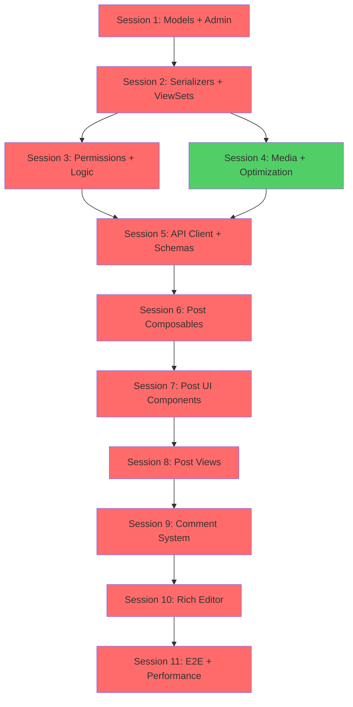

# Project Plan: Blog Platform

## Overview

A modern blog platform with post authoring, commenting, categorization, and tagging. Supports rich media uploads, nested comments, and draft/publish workflows. Built with TDD principles and optimized for performance.

**Complexity**: Intermediate
**Target Users**: Bloggers, content creators, small publications

## Technical Stack

- **Backend**: Django 5.2 + Django REST Framework + PostgreSQL
- **Frontend**: Vue 3 (Composition API) + TypeScript + Shadcn-vue + Tailwind CSS
- **Infrastructure**: Docker + Redis + Celery
- **Storage**: Local media files (can be extended to S3/CloudFlare R2)
- **Caching**: Redis (post lists, categories, tags)

## Phases

### Phase 1: Backend Foundation (Sessions 1-4)
**Goal**: Build robust, tested backend API for blog functionality

#### Session 1: Models + Admin (TDD)
- Create `blog` Django app
- Implement Post, Comment, Category, Tag models
- Auto-slug generation for Post, Category, Tag
- Register models in Django admin
- Write comprehensive model tests
- **Estimated Time**: 2.5 hours
- **Tests**: ~70 tests

#### Session 2: Serializers + ViewSets (TDD)
- PostSerializer with nested categories/tags
- CommentSerializer with nested replies
- CategorySerializer, TagSerializer
- PostViewSet with custom actions (publish, increment_view)
- CommentViewSet with nested routing
- **Estimated Time**: 3 hours
- **Tests**: ~90 tests

#### Session 3: Permissions + Business Logic (TDD)
- IsAuthorOrReadOnly permission
- Draft post visibility (author only)
- Comment moderation logic
- Post publishing workflow
- View count increment (atomic, rate-limited)
- **Estimated Time**: 2.5 hours
- **Tests**: ~60 tests

#### Session 4: Media Uploads + Optimization (TDD)
- Featured image upload handling
- Image thumbnail generation (small, medium, large)
- Query optimization (select_related, prefetch_related)
- Redis caching for post lists and detail
- **Estimated Time**: 2.5 hours
- **Tests**: ~40 tests

**Phase 1 Total**: 10.5 hours, ~260 tests

---

### Phase 2: Frontend Foundation (Sessions 5-8)
**Goal**: Build type-safe, tested frontend with rich user experience

#### Session 5: API Client + Zod Schemas (Code Generation)
- Generate TypeScript SDK from OpenAPI schema
- Create Zod validation schemas (post, comment)
- Set up React Query for data fetching
- **Estimated Time**: 1 hour
- **Tests**: ~20 tests (schema validation)

#### Session 6: Post Composables + Stores (TDD)
- `usePost` composable (fetch, cache, increment view)
- `usePosts` composable (list, filters, infinite scroll)
- `useCategories`, `useTags` composables
- Post store (if needed for complex state)
- **Estimated Time**: 2.5 hours
- **Tests**: ~50 tests

#### Session 7: Post UI Components (TDD)
- PostCard (featured image, excerpt, metadata)
- PostGrid with pagination/infinite scroll
- PostFilters (category, tag, search)
- CategoryBadge, TagBadge
- Sidebar (popular posts, categories, tag cloud)
- **Estimated Time**: 3 hours
- **Tests**: ~60 tests

#### Session 8: Post Views + Routing (TDD)
- PostListView (filters, pagination)
- PostDetailView (post content, comments)
- CreatePostView (rich form with preview)
- EditPostView (update post)
- MyPostsView (user's posts, drafts)
- **Estimated Time**: 3.5 hours
- **Tests**: ~70 tests

**Phase 2 Total**: 10 hours, ~200 tests

---

### Phase 3: Comments & Rich Features (Sessions 9-10)
**Goal**: Implement commenting system and post authoring

#### Session 9: Comment System (TDD)
- `useComments` composable (list, create, update, delete)
- CommentForm component (with parent_id for replies)
- CommentList component (nested rendering)
- CommentItem component (reply button, edit, delete)
- Comment moderation UI (for admins)
- **Estimated Time**: 3 hours
- **Tests**: ~60 tests

#### Session 10: Rich Post Editor (TDD)
- ContentEditor component (rich text with Tiptap or similar)
- Image upload within editor
- Live preview panel
- Category/Tag multi-select with autocomplete
- Draft auto-save (localStorage + API)
- **Estimated Time**: 3.5 hours
- **Tests**: ~50 tests

**Phase 3 Total**: 6.5 hours, ~110 tests

---

### Phase 4: Integration & Polish (Session 11)
**Goal**: End-to-end testing, optimization, deployment prep

#### Session 11: E2E Testing + Performance (TDD)
- E2E workflow: Create post → Publish → View → Comment
- E2E workflow: Filter posts by category/tag
- Image optimization verification
- Cache hit/miss analysis
- Performance testing (page load, API response times)
- Type checking (0 TypeScript errors)
- Final coverage report (>85% target)
- Documentation updates
- **Estimated Time**: 3 hours
- **Tests**: ~30 E2E tests

**Phase 4 Total**: 3 hours, ~30 tests

---

## Summary

**Total Sessions**: 11
**Total Estimated Time**: 30 hours
**Total Test Count**: ~600 tests
**Backend Coverage Target**: 90%
**Frontend Coverage Target**: 85%

## Session Dependency Graph

This diagram shows which sessions must be completed before others can begin, helping identify the critical path and opportunities for parallel work.

**Legend**:
- 🔴 Red nodes: Critical path (must complete sequentially) - 10 sessions
- 🟢 Green nodes: Can run in parallel with Session 3 (Permissions)
- Arrows: Dependencies (A → B means "A must complete before B starts")

**Key Insights**:
1. **Media Uploads (S4)** can run in parallel with Permissions (S3) - potential 2.5 hour time save if working with multiple developers
2. **Critical path**: S1 → S2 → S3 → S5 → S6 → S7 → S8 → S9 → S10 → S11 (27.5 hours minimum)
3. **Earliest finish**: 27.5 hours (if S4 runs parallel with S3), 30 hours (if sequential)
4. **Frontend work** can begin after Session 5 (API client generation)

## Data Models Summary

| Model    | Fields | Relationships        | Indexes |
|----------|--------|---------------------|---------|
| Post     | 13     | User, Comment, Category, Tag | 6 |
| Comment  | 8      | Post, User, self (nested) | 4 |
| Category | 4      | Post (M2M)          | 2 |
| Tag      | 3      | Post (M2M)          | 2 |

## API Endpoints Summary

| Resource  | Endpoints | Methods          | Permissions |
|-----------|-----------|------------------|-------------|
| Posts     | 6         | GET, POST, PATCH, DELETE | Public read, Auth write |
| Comments  | 4         | GET, POST, PATCH, DELETE | Auth required |
| Categories| 2         | GET              | Public |
| Tags      | 2         | GET              | Public |

**Total Endpoints**: 14

## Frontend Components Summary

| Component Type | Count | Testing Priority |
|---------------|-------|-----------------|
| Views         | 5     | High            |
| Components    | 13    | High            |
| Composables   | 5     | High            |
| Stores        | 1     | Medium          |

**Total Components**: 24

## Success Criteria

- ✅ All tests pass (>85% coverage)
- ✅ Type-safe (0 TypeScript `any`, 0 type errors)
- ✅ OpenAPI schema accurate and up-to-date
- ✅ Images optimized (WebP, thumbnails)
- ✅ Caching working (Redis hit rate >70%)
- ✅ Post creation → publish → view workflow working E2E
- ✅ Commenting (including nested replies) working
- ✅ Category/tag filtering working
- ✅ Draft posts only visible to author
- ✅ Rich text editor functional
- ✅ Docker deployment working

## Testing Strategy

### Backend (pytest + coverage)
- **Models**: Field validation, relationships, custom methods
- **Serializers**: Validation rules, nested serialization
- **ViewSets**: CRUD operations, custom actions, permissions
- **Permissions**: Draft visibility, author-only edit, admin delete

**Target**: 90% coverage

### Frontend (Vitest + Vue Test Utils)
- **Components**: Rendering, props, events, slots
- **Composables**: Data fetching, mutations, caching
- **Views**: Full page rendering, user interactions
- **Schemas**: Zod validation rules

**Target**: 85% coverage

### E2E (Playwright - optional but recommended)
- Complete user flows: Create → Publish → View → Comment
- Category/tag filtering
- Draft/publish workflow
- Image upload and display

**Target**: Critical paths covered

## Performance Targets

- **Homepage load**: < 2 seconds
- **Post list API**: < 200ms (with caching)
- **Post detail API**: < 300ms (with caching)
- **Comment creation**: < 500ms
- **Image upload**: < 3 seconds (5MB max)

## Security Checklist

- ✅ Draft posts protected (author-only visibility)
- ✅ Comment content sanitized (XSS prevention)
- ✅ Image uploads validated (type, size, dimensions)
- ✅ Rate limiting on post/comment creation
- ✅ CSRF protection enabled
- ✅ SQL injection prevention (ORM parameterized queries)
- ✅ Permission checks on all mutations

## Optional Enhancements (Post-MVP)

- [ ] Rich text formatting in comments
- [ ] Post likes/bookmarks
- [ ] Email notifications on new comments
- [ ] RSS feed generation
- [ ] SEO meta tags (Open Graph, Twitter Cards)
- [ ] Related posts recommendation
- [ ] Author profiles with bio
- [ ] Full-text search with PostgreSQL or Elasticsearch
- [ ] Social sharing buttons
- [ ] Analytics dashboard (views, popular posts)

## Timeline

**Week 1**: Backend Foundation (Phase 1)
**Week 2**: Frontend Foundation (Phase 2)
**Week 3**: Comments & Rich Features (Phase 3)
**Week 4**: Integration & Polish (Phase 4)

**Total Duration**: 4 weeks (part-time) or 2 weeks (full-time)

---

**Ready to start building?** Follow the detailed session tasks in the `tasks/` directory.
