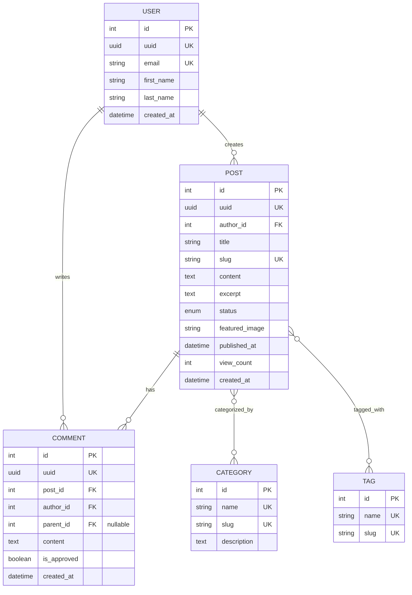
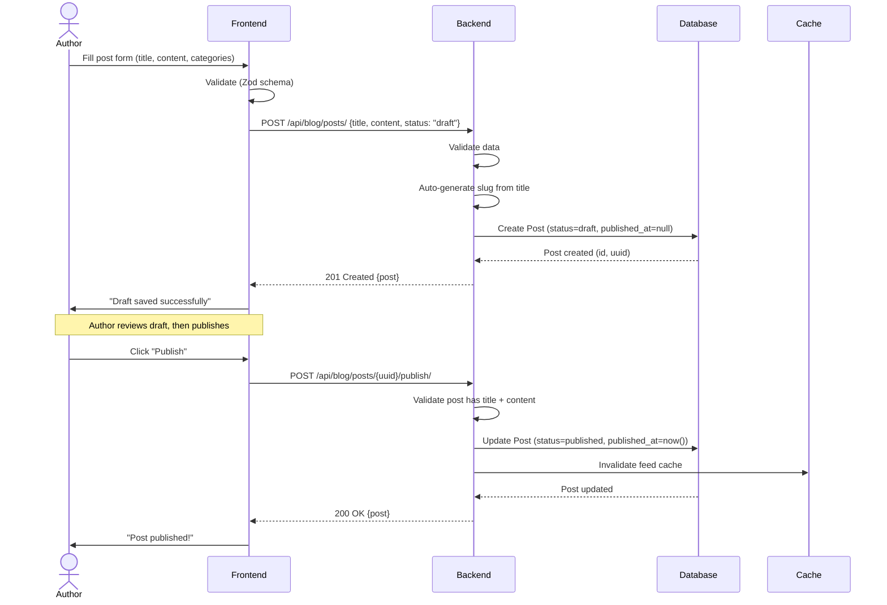
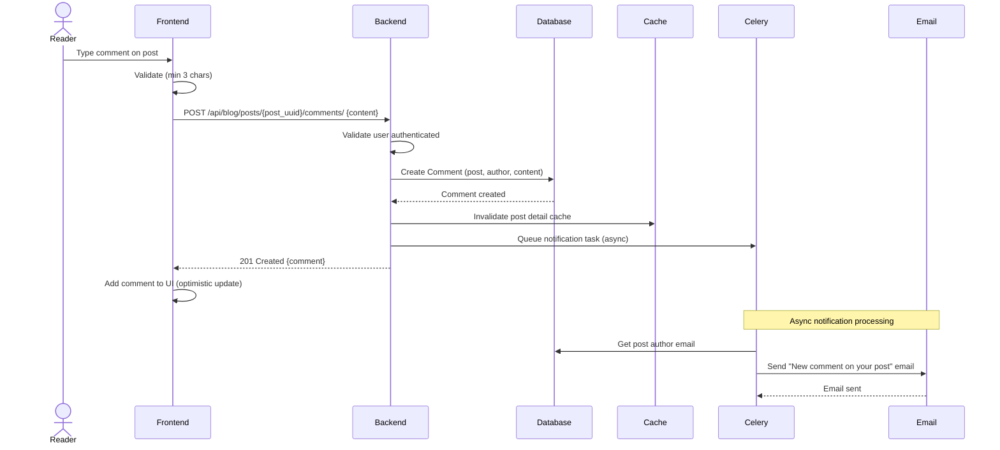

# Blog Platform - Technical Requirements

**Generated from**: Blog Platform Template
**Complexity**: Intermediate
**Features**: Posts, Comments, Categories, Tags, Media Uploads

---

## Data Models

### Post Model

**File**: `backend/apps/blog/models/post.py`

**Fields**:

- `id` (AutoField, primary key)
- `uuid` (UUIDField, unique, default=uuid4, indexed) - For public API exposure
- `title` (CharField, max_length=200, required)
- `slug` (SlugField, max_length=220, unique, auto-generated from title)
- `content` (TextField, required)
- `excerpt` (TextField, max_length=500, optional) - Short summary
- `status` (CharField, choices=['draft', 'published', 'archived'], default='draft')
- `featured_image` (ImageField, upload_to='blog/images/', optional)
- `author` (ForeignKey to User, on_delete=CASCADE, related_name='posts')
- `published_at` (DateTimeField, null=True, blank=True)
- `view_count` (PositiveIntegerField, default=0)
- `created_at` (DateTimeField, auto_now_add=True)
- `updated_at` (DateTimeField, auto_now=True)

**Relationships**:

- Author: Many-to-One with User
- Comments: One-to-Many with Comment
- Categories: Many-to-Many with Category
- Tags: Many-to-Many with Tag

**Indexes**:

- `uuid` (unique)
- `slug` (unique)
- `status` (for filtering)
- `published_at` (for sorting)
- `created_at` (for sorting)
- Composite: `['status', 'published_at']` (for published posts query)

**Validation**:

- Title: Required, max 200 chars
- Slug: Auto-generated from title, unique
- Content: Required, min 10 chars
- Status: Must be one of ['draft', 'published', 'archived']
- Published_at: Required if status='published'
- Featured_image: Max 5MB, formats: jpg, png, webp

**Custom Methods**:

- `save()`: Auto-generate slug from title if not provided
- `publish()`: Set status='published', published_at=now()
- `get_reading_time()`: Calculate reading time based on word count
- `increment_view_count()`: Atomic increment of view_count

---

### Comment Model

**File**: `backend/apps/blog/models/comment.py`

**Fields**:

- `id` (AutoField, primary key)
- `uuid` (UUIDField, unique, default=uuid4, indexed)
- `post` (ForeignKey to Post, on_delete=CASCADE, related_name='comments')
- `author` (ForeignKey to User, on_delete=CASCADE, related_name='comments')
- `content` (TextField, required, max_length=1000)
- `parent` (ForeignKey to self, null=True, blank=True, related_name='replies') - For nested comments
- `is_approved` (BooleanField, default=True) - Moderation flag
- `created_at` (DateTimeField, auto_now_add=True)
- `updated_at` (DateTimeField, auto_now=True)

**Relationships**:

- Post: Many-to-One with Post
- Author: Many-to-One with User
- Parent: Self-referential for nested comments

**Indexes**:

- `uuid` (unique)
- `post` (for filtering comments by post)
- `author` (for filtering user's comments)
- `created_at` (for sorting)

**Validation**:

- Content: Required, max 1000 chars, min 3 chars
- Parent: If set, must be a top-level comment (no nested replies to replies)

---

### Category Model

**File**: `backend/apps/blog/models/category.py`

**Fields**:

- `id` (AutoField, primary key)
- `name` (CharField, max_length=100, unique)
- `slug` (SlugField, max_length=110, unique)
- `description` (TextField, optional)
- `created_at` (DateTimeField, auto_now_add=True)

**Relationships**:

- Posts: Many-to-Many with Post

**Indexes**:

- `slug` (unique)
- `name` (unique)

**Validation**:

- Name: Required, unique, max 100 chars
- Slug: Auto-generated from name, unique

---

### Tag Model

**File**: `backend/apps/blog/models/tag.py`

**Fields**:

- `id` (AutoField, primary key)
- `name` (CharField, max_length=50, unique)
- `slug` (SlugField, max_length=60, unique)
- `created_at` (DateTimeField, auto_now_add=True)

**Relationships**:

- Posts: Many-to-Many with Post

**Indexes**:

- `slug` (unique)
- `name` (unique)

**Validation**:

- Name: Required, unique, max 50 chars
- Slug: Auto-generated from name, unique

---

## Data Model Visualization



---

## API Endpoints

### Posts Endpoints

**Base URL**: `/api/blog/`

#### List/Create Posts

- **GET** `/api/blog/posts/` - List published posts (public)
  - Query params: `?category={slug}`, `?tag={slug}`, `?search={query}`, `?ordering=-published_at`
  - Permissions: AllowAny
  - Response: Paginated list (20 per page)

- **POST** `/api/blog/posts/` - Create new post (authenticated)
  - Permissions: IsAuthenticated
  - Request body: `{ title, content, excerpt?, status, category_ids[], tag_ids[] }`
  - Response: 201 Created

#### Retrieve/Update/Delete Post

- **GET** `/api/blog/posts/{uuid}/` - Get post details
  - Permissions: AllowAny (if published), IsAuthor (if draft)
  - Response: Full post with comments

- **PATCH** `/api/blog/posts/{uuid}/` - Update post
  - Permissions: IsAuthor
  - Request body: Partial update
  - Response: 200 OK

- **DELETE** `/api/blog/posts/{uuid}/` - Delete post
  - Permissions: IsAuthor or IsAdmin
  - Response: 204 No Content

#### Custom Actions

- **POST** `/api/blog/posts/{uuid}/publish/` - Publish draft post
  - Permissions: IsAuthor
  - Response: 200 OK

- **POST** `/api/blog/posts/{uuid}/increment_view/` - Increment view count
  - Permissions: AllowAny
  - Response: 200 OK

### Comments Endpoints

#### List/Create Comments

- **GET** `/api/blog/posts/{post_uuid}/comments/` - List comments for post
  - Permissions: AllowAny
  - Response: Paginated list (50 per page), nested structure

- **POST** `/api/blog/posts/{post_uuid}/comments/` - Create comment
  - Permissions: IsAuthenticated
  - Request body: `{ content, parent_id? }`
  - Response: 201 Created

#### Update/Delete Comment

- **PATCH** `/api/blog/comments/{uuid}/` - Update comment
  - Permissions: IsAuthor (within 15 mins of creation)
  - Request body: `{ content }`
  - Response: 200 OK

- **DELETE** `/api/blog/comments/{uuid}/` - Delete comment
  - Permissions: IsAuthor or IsAdmin
  - Response: 204 No Content

### Categories Endpoints

- **GET** `/api/blog/categories/` - List all categories
  - Permissions: AllowAny
  - Response: List with post count

- **GET** `/api/blog/categories/{slug}/` - Get category with posts
  - Permissions: AllowAny
  - Response: Category + paginated posts

### Tags Endpoints

- **GET** `/api/blog/tags/` - List all tags
  - Permissions: AllowAny
  - Response: List with post count

- **GET** `/api/blog/tags/{slug}/` - Get tag with posts
  - Permissions: AllowAny
  - Response: Tag + paginated posts

---

## Frontend Components

### Component Hierarchy

```
PostListView
├── PostFilters (categories, tags, search)
├── PostGrid
│   ├── PostCard (featured image, title, excerpt, metadata)
│   │   └── CategoryBadge
│   └── Pagination
└── Sidebar
    ├── PopularPosts
    ├── Categories
    └── TagCloud

PostDetailView
├── PostHeader (title, author, date, categories, tags)
├── FeaturedImage
├── PostContent (rich text rendering)
├── PostActions (share, bookmark)
├── AuthorBio
└── CommentSection
    ├── CommentForm
    └── CommentList
        └── CommentItem (nested, with replies)

CreatePostView (authenticated)
├── PostForm
│   ├── TitleInput
│   ├── ContentEditor (rich text)
│   ├── ExcerptTextarea
│   ├── CategorySelect (multi-select)
│   ├── TagInput (autocomplete, create new)
│   ├── FeaturedImageUpload
│   └── StatusSelect (draft/published)
└── PreviewPanel (live preview)

MyPostsView (authenticated)
└── PostTable
    ├── StatusBadge
    ├── ViewCount
    └── Actions (edit, delete, publish)
```

### Key Composables

**`usePost.ts`**:

```typescript
export const usePost = (uuid: string) => {
  const { data: post, isLoading } = useQuery({
    queryKey: ['post', uuid],
    queryFn: () => apiClient.blog.postsRetrieve({ path: { uuid } })
  })

  const incrementView = useMutation({
    mutationFn: () => apiClient.blog.postsIncrementViewCreate({ path: { uuid } })
  })

  return { post, isLoading, incrementView }
}
```

**`usePosts.ts`**:

```typescript
export const usePosts = (filters?: PostFilters) => {
  const { data, isLoading, fetchNextPage } = useInfiniteQuery({
    queryKey: ['posts', filters],
    queryFn: ({ pageParam = 1 }) => apiClient.blog.postsList({
      query: { ...filters, page: pageParam }
    })
  })

  return { posts: data?.pages.flatMap(p => p.results), isLoading, fetchNextPage }
}
```

**`useComments.ts`**:

```typescript
export const useComments = (postUuid: string) => {
  const { data: comments } = useQuery({
    queryKey: ['comments', postUuid],
    queryFn: () => apiClient.blog.postsCommentsList({ path: { post_uuid: postUuid } })
  })

  const createComment = useMutation({
    mutationFn: (data: CreateCommentData) =>
      apiClient.blog.postsCommentsCreate({ path: { post_uuid: postUuid }, body: data }),
    onSuccess: () => queryClient.invalidateQueries(['comments', postUuid])
  })

  return { comments, createComment }
}
```

---

## Validation Rules

### Post Validation (Backend + Frontend)

**Backend** (`apps/blog/serializers/post.py`):

```python
class PostSerializer(serializers.ModelSerializer):
    def validate_title(self, value):
        if len(value) < 5:
            raise ValidationError("Title must be at least 5 characters")
        return value

    def validate(self, attrs):
        if attrs.get('status') == 'published' and not attrs.get('published_at'):
            attrs['published_at'] = timezone.now()
        return attrs
```

**Frontend Zod Schema** (`frontend/src/schemas/post.ts`):

```typescript
export const postSchema = z.object({
  title: z.string().min(5, "Title must be at least 5 characters").max(200),
  content: z.string().min(10, "Content must be at least 10 characters"),
  excerpt: z.string().max(500).optional(),
  status: z.enum(['draft', 'published', 'archived']),
  category_ids: z.array(z.number()).min(1, "Select at least one category"),
  tag_ids: z.array(z.number()).optional(),
  featured_image: z.instanceof(File).optional().refine(
    (file) => !file || file.size <= 5 * 1024 * 1024,
    "Image must be less than 5MB"
  )
})

export type PostFormData = z.infer<typeof postSchema>
```

### Comment Validation

**Backend**:

```python
class CommentSerializer(serializers.ModelSerializer):
    def validate_content(self, value):
        if len(value) < 3:
            raise ValidationError("Comment must be at least 3 characters")
        if len(value) > 1000:
            raise ValidationError("Comment must be less than 1000 characters")
        return value
```

**Frontend Zod Schema**:

```typescript
export const commentSchema = z.object({
  content: z.string().min(3).max(1000),
  parent_id: z.number().optional()
})
```

---

## Key Workflow Visualizations

### Post Creation & Publishing Flow



### Comment Creation with Notification Flow



---

## Test Coverage Requirements

### Backend Tests

**Models** (`apps/blog/tests/test_models.py`):

- Post model creation and field validation
- Slug auto-generation from title
- Publish method sets published_at
- View count increment (atomic)
- Reading time calculation
- Comment model with nested replies
- Category and Tag uniqueness

**Serializers** (`apps/blog/tests/test_serializers.py`):

- Post serializer validation
- Comment serializer with parent validation
- Category and Tag serialization

**ViewSets** (`apps/blog/tests/test_viewsets.py`):

- List published posts (public)
- Create post (authenticated)
- Update post (author only)
- Delete post (author or admin)
- Publish action
- Increment view count
- List/create comments
- Nested comment replies

**Permissions** (`apps/blog/tests/test_permissions.py`):

- Anonymous can read published posts
- Anonymous cannot read draft posts
- Author can CRUD their own posts
- Non-author cannot edit others' posts
- Admin can delete any post

**Minimum Coverage**: 90% (critical data operations)

### Frontend Tests

**Components** (`frontend/src/components/blog/*.test.ts`):

- PostCard renders correctly
- PostForm validation
- CommentForm submission
- CommentList nested rendering
- PostFilters emit events

**Composables** (`frontend/src/composables/*.test.ts`):

- usePost fetches and caches data
- usePosts infinite scroll
- useComments CRUD operations

**Views** (`frontend/src/views/blog/*.test.ts`):

- PostListView filters and pagination
- PostDetailView renders post + comments
- CreatePostView form submission

**Minimum Coverage**: 85%

---

## Performance Considerations

### Database Optimizations

- Use `select_related('author')` for post queries
- Use `prefetch_related('categories', 'tags', 'comments')` for detail views
- Index on `status` and `published_at` for published posts query
- Composite index on `['status', 'published_at']` for performance

### Caching Strategy

- Cache published post list: 5 minutes
- Cache post detail: 10 minutes (invalidate on update)
- Cache categories/tags: 1 hour (rarely change)

### Image Optimization

- Generate thumbnails on upload (small, medium, large)
- Use WebP format for better compression
- Lazy load images in post list
- CDN for featured images (optional)

---

## Security Considerations

### Permissions

- Draft posts: Only author can view/edit
- Published posts: Public read, author can edit
- Comments: Authenticated users can create, only author can edit/delete (within 15 mins)
- Moderation: Add `is_approved` flag for comment moderation

### Input Sanitization

- Sanitize HTML in post content (allow safe tags only)
- Escape user input in comments
- Validate image uploads (file type, size, dimensions)

### Rate Limiting

- Post creation: 10 posts per hour per user
- Comment creation: 30 comments per hour per user
- View count increment: 1 per IP per post per 24 hours

---

## Estimated Complexity

**Models**: 4 (Post, Comment, Category, Tag)
**API Endpoints**: 15
**Frontend Components**: 18
**Estimated Sessions**: 11
**Estimated Time**: 16-20 hours
**Test Count**: ~280 tests
